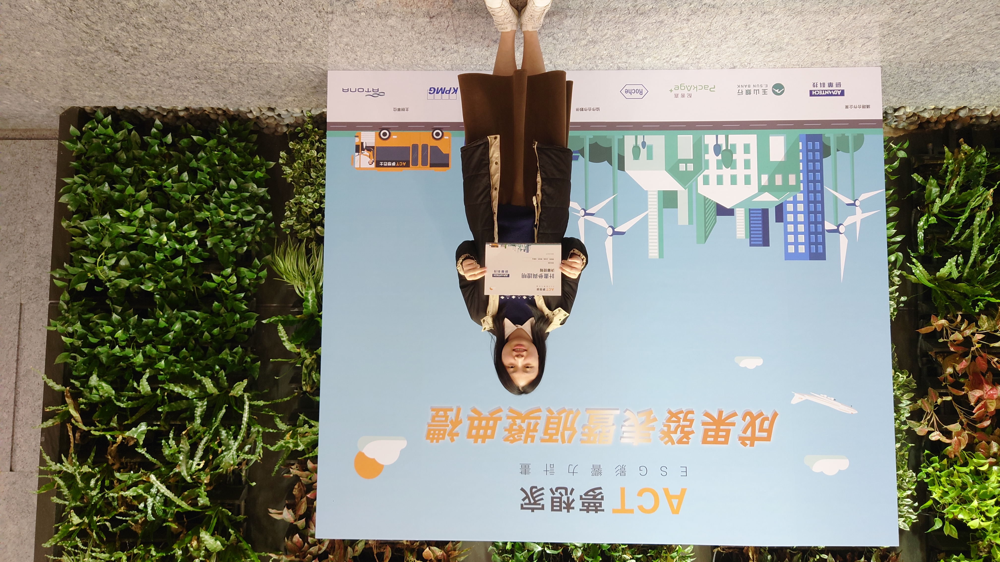
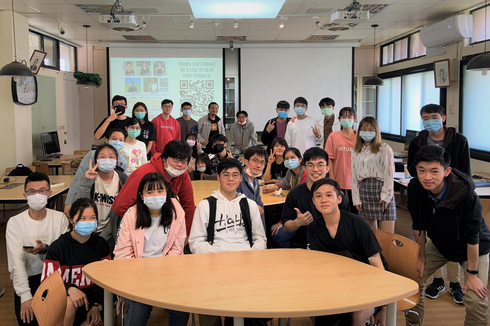

<h1 style="font-family: 'Noto Serif TC', serif;">About me </h1>

### 簡介 Brief Introduction 
您好，我是陳佳妤，目前就讀國立中央大學資訊管理系二年級。對於資訊領域有很大的熱忱，喜歡多方涉略，積極進取，學習力強。現在在學校正參與一個團體專案，共同開發手機應用程式，在團隊裡負責前端開發，對於後端也具有一定了解。另外，目前也正學習資料探勘，所以對於機器學習也有一定的認識。期許自己能透過暑期的實習，對資訊領域有更正確和專業的認識，精進個人的能力。

### 基本資料 Basic Info
- Gender: Female
- Date of Birth: June, 2022
- Email :e-mail: : chen027@g.ncu.edu.tw
- School: Central University 
-Working Experience: None
-Language Ability: Fluent in English and Chinese

### Coding Language
- [x]  _C/C++_
- [x]  _Python(Machine Learning and web crawler)_
- [x]  _JavaScript (React Native Frame)_
- [x]  _PHP_
- [x]  _MySQL_
- [x]  _HTML_

### Experience in School

1. NCU-APP ( https://idea.ncu.edu.tw/community/3 )
    - Front-end developing
    - Using GitHub, React Native and Firebase
2. Participating in ACT夢想家‣ ESG影響力計畫-研華組(https://act-esg.com.tw/)
    - leader of the team, MASK.
    - **TOP 8** of all 'Advantech' teams.
    

### English Skills
- I participated in lots of English sessions at noon, mostly last for 50 min.

- TOEIC score: 780 in total. 
